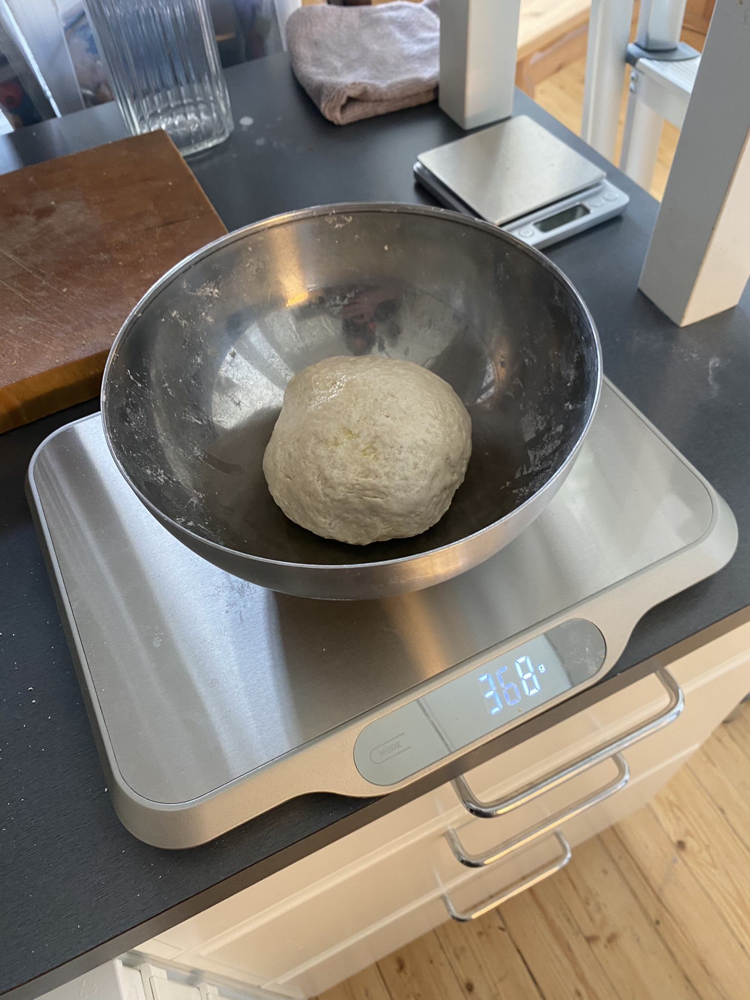

# Santeri's recipes

Repetition and iteration of a thing is fun.
I often prefer to measure in grams, but volumetric measurements are used for conviniency.
Seasoning is not exact and often not defined accurately. I prefer to taste the food while cooking.

Attribution is given sometimes.

Thanks mom!

## Table of plans

1. Men of Horse sea
1. [Pan pizza](#iron-skillet-pan-pizza)
1. Seitan is good

## Baseline pizza dough
The baseline.

```
150g 42C water
11g dried yeast
5g sugar
5g salt
200g fine white wheat flour
A drop of oil
```
1. Warm up water and measure it onto the mixing bowl
1. Mix up yest, sugar and salt into the water
1. Measure 200g flour
1. Beat up at least for 5 minutes
1. Tuck the dough in, lube the surface with a drop of oil
1. Let rest for 1,5 hours, fold twice
1. Let rest for 1,5 hours

### Tricks
For extra fluffiness, throw in a bowl of water into the oven while heating. There should be enough of water to create water vapour for the first 10 minutes of the bake time. This helps the dough to keep the moisture inside while baking.

If your appartment is cold, sink the oversized mixing bowl into the water bath, and keep the temperature stable around 40C with sous vide. Metal bowls conduct better. Using oven is also plausible. Just don't leave it on after short pre-heat.

## Iron skillet pan pizza
How about milk?

```
300g milk
11g dried yeast
50g melted butter or oil
1/2 spoon sugar
1 tea spoon salt
600g fine white wheat flour
```
1. Heat up the milk to 42C
1. Premix the milk, yeast, sugar and salt in flour volcano
1. Leave the dough a bit moist because it will not be rolled after the rise
1. Cover with oil and let it rise under a towel for 45 minutes
1. Pre-heat the oven and the skillet to 250C
1. Transfer the dough to the skillet, top up and bake for 15 minutes


